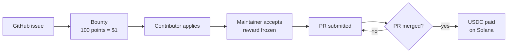

# 🌱 Greenfield

> Turn open source contributions into USDC rewards on Solana.

Greenfield links **GitHub issues** to **bounties**. Maintainers price an issue, contributors apply and open a PR, and a **confirmed merge** pays USDC to the contributor's wallet.



Repository: [github.com/GermanoDevelopment/greenfield](https://github.com/GermanoDevelopment/greenfield)

## Stack

- **Backend:** FastAPI, SQLAlchemy 2 (async), asyncpg, Alembic. Port `8080`.
- **Frontend:** React 19, Vite, TypeScript, Tailwind, `@solana/kit`. Port `5173` (dev) or `3000` (Docker, Nginx).
- **Database:** Postgres 15. Port `5432`.
- **Contract:** Anchor (Rust). A scaffold today, not used for payouts.

## Quickstart

Requirements: Docker with Compose. For local development also Python 3.12+, [uv](https://docs.astral.sh/uv/) and Node.js 20+.

### Option A: everything in Docker

```bash
docker compose up -d --build
curl http://localhost:8080/api/v1/health
```

Open http://localhost:3000 (app) and http://localhost:8080/docs (Swagger). Migrations run on startup.

```bash
docker compose logs -f backend frontend
docker compose down       # stop, keep data
docker compose down -v    # stop and wipe the local database
```

The Docker frontend is a static build: `VITE_API_URL` is baked in at build time and `frontend/.env` is ignored. It defaults to `http://localhost:8080/api/v1`. After frontend changes, run `docker compose up -d --build frontend`.

### Option B: local development (recommended)

Postgres in Docker, backend and frontend on your machine with hot reload.

```bash
# 1. Database
docker compose up -d postgres

# 2. Backend (terminal 1)
cd backend
cp .env.example .env
uv sync
uv run alembic upgrade head
uv run uvicorn app.main:app --reload --port 8080

# 3. Frontend (terminal 2)
cd frontend
cp .env.example .env
npm install
npm run dev
```

Open http://localhost:5173. The default `DATABASE_URL` in `.env.example` works as is; the backend converts it to `postgresql+asyncpg://`.

### First login

- **Email and password:** sign up in the app's login modal, or `POST /api/v1/auth/register`.
- **Seeded dev admins:** created on every backend boot with the password `admin123` (see `backend/app/services/admin_seed.py`).
- **GitHub OAuth:** needs `GITHUB_CLIENT_ID` and `GITHUB_CLIENT_SECRET`.

> ⚠️ The seeded admins are for development only. Remove them or change the passwords, and set your own `JWT_SECRET`, before any shared deployment.

## Configuration

The `.env.example` files work out of the box.

**Backend** (`backend/.env`):

- `DATABASE_URL`: Postgres connection string. Docker Compose overrides the host to `postgres`.
- `JWT_SECRET`: **change in production**. `JWT_EXPIRATION_MINUTES` defaults to `1440`.
- `CORS_ORIGINS`: allowed frontend origins. Defaults to ports `5173` and `3000`.
- `GITHUB_CLIENT_ID`, `GITHUB_CLIENT_SECRET`, `GITHUB_REDIRECT_URI`: GitHub OAuth.
- `GITHUB_WEBHOOK_SECRET`: HMAC secret for the webhook. **If empty, any payload is accepted.**
- `GITHUB_TOKEN`: token for GitHub API calls when the user has none.
- `ADMIN_GITHUB_USERNAMES`: GitHub usernames that become ADMIN on OAuth login.
- `SOLANA_RPC_URL`: defaults to devnet.
- `SOLANA_TREASURY_KEYPAIR_PATH` or `SOLANA_TREASURY_PRIVATE_KEY` (base58): treasury that pays bounties.
- `USDC_MINT_DEVNET`: USDC mint used for payouts.

**Frontend** (`frontend/.env`). Vite reads these at boot, so restart `npm run dev` after changes:

- `VITE_API_URL`: defaults to `http://localhost:8080/api/v1`.
- `VITE_SOLANA_RPC_URL` and `VITE_SOLANA_CHAIN`: default to devnet.

## How it works

A bounty moves `OPEN → ASSIGNED → SUBMITTED → COMPLETED`. It can be `CANCELLED` from any non-final state, and a rejected PR sends it back from `SUBMITTED` to `ASSIGNED`. `COMPLETED` and `CANCELLED` are final.

It completes when the GitHub webhook reports a merged PR, or when the issuer or an admin calls `POST /bounties/{id}/complete`. Either way the backend verifies the merge first.

Rules:

- **Merge required.** If the backend cannot verify the merge, the bounty does not complete.
- **Frozen reward.** The reward can only change while `OPEN`.
- **One payout per issue.** `complete` is only valid from `SUBMITTED`.
- **Fixed conversion.** `100 points = $1 USDC = 1,000,000 micro-USDC`.

### Payouts today

Payouts do **not** go through the Anchor contract (it only has `initialize`). On completion the backend sends SPL USDC from the treasury to the contributor's wallet using [`solinpy`](https://pypi.org/project/solinpy/).

- Without a configured treasury, the backend uses an ephemeral keypair with no funds.
- If the contributor has no linked wallet, the bounty completes without a payout.
- If the transfer fails for any reason (no `solinpy`, RPC down, empty treasury), the backend stores a **simulated** signature, `sim_<wallet>_<amount>`, and carries on. That is not a real transaction.
- For real devnet payouts, run `uv pip install solinpy --no-deps` in `backend/` and configure the treasury.

## Commands

```bash
# backend/
uv run uvicorn app.main:app --reload --port 8080
uv run alembic upgrade head
uv run alembic revision --autogenerate -m "message"
uv run pytest                    # in-memory SQLite, no Postgres needed
uv run ruff check .
uv run ruff format --check .

# frontend/
npm run dev
npm run build                    # tsc + build to dist/
npm run preview
npm run lint                     # oxlint

# contract/ (optional)
npm install
anchor build
anchor test
```

The contract uses the Anchor placeholder program ID `Fg6PaFpoGXkYsidMpWTK6W2BeZ7FEfcYkg476zPFsLnS` and the wallet at `~/.config/solana/id.json`. For devnet: `solana config set --url devnet && solana airdrop 2`.

## API

Everything lives under `/api/v1`:

- Swagger: http://localhost:8080/docs
- ReDoc: http://localhost:8080/redoc
- OpenAPI JSON: http://localhost:8080/openapi.json
- Health: http://localhost:8080/api/v1/health

Route groups: `auth`, `users`, `projects`, `repositories`, `bounties`, `admin`, `webhooks`. Bounty routes are listed in [`backend/README.md`](backend/README.md).

**GitHub webhook.** To complete bounties on merge, point a repository webhook at `POST /api/v1/webhooks/github` with content type `application/json` and the **Pull requests** and **Issues** events. Use the same secret in GitHub and in `GITHUB_WEBHOOK_SECRET`.

## Repository layout

```
greenfield/
├── backend/             # FastAPI app, Alembic migrations, pytest
├── frontend/            # React app (core / infrastructure / presentation)
├── contract/            # Anchor program (scaffold)
├── demo-video/          # Demo video (Remotion)
├── docker-compose.yml   # Postgres + backend + frontend
└── FRONTEND-REQUIREMENTS.md
```

## Troubleshooting

- **Port 5432 or 8080 already in use:** stop the local service or the other container. Find the process with `sudo lsof -i :5432` or `lsof -i :8080`.
- **Backend cannot reach the database:** Postgres may still be starting. Check `docker compose ps` and `docker compose logs postgres`, then rerun `uv run alembic upgrade head`.
- **Migrations say "up to date" but tables are missing:** `DATABASE_URL` points to another database.
- **Frontend shows `Failed to fetch` or a CORS error:** check `VITE_API_URL` and that `curl localhost:8080/api/v1/health` works.
- **`VITE_*` change has no effect:** restart `npm run dev`. In Docker, rebuild with `--build`.
- **`/auth/github/login` fails:** the GitHub OAuth variables are empty. Use email and password in development.
- **`tx_signature` starts with `sim_`:** the payout was simulated. See [Payouts today](#payouts-today).
- **Bounty completed with no `tx_signature`:** the contributor has no wallet linked (`PATCH /users/me`).
- **Webhook returns `403 Invalid signature`:** the secret in GitHub differs from `GITHUB_WEBHOOK_SECRET`.

Full local reset:

```bash
docker compose down -v
docker compose up -d postgres
cd backend && uv run alembic upgrade head
```
